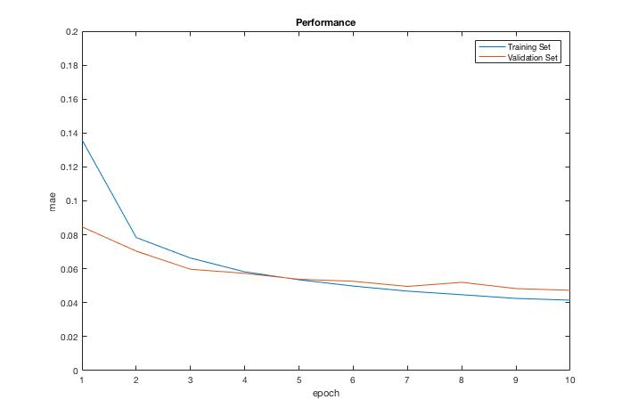

### A minimal Keras implementation of CapsNet in the paper:
[Sara Sabour, Nicholas Frosst, Geoffrey E Hinton. Dynamic Routing Between Capsules. NIPS 2017](https://arxiv.org/abs/1710.09829)

### Usage
```
git clone https://github.com/fengwang/minimal-capsule.git
cd ./minimal-capsule
pip install keras tensorflow
python ./mini_capsule.py
```

### Performance
mean absolute error at the first 10 steps:


### Acknowledgement


- [CapsNet-Keras](https://github.com/XifengGuo/CapsNet-Keras)

- [CapsNet-Tensorflow](https://github.com/naturomics/CapsNet-Tensorflow)

